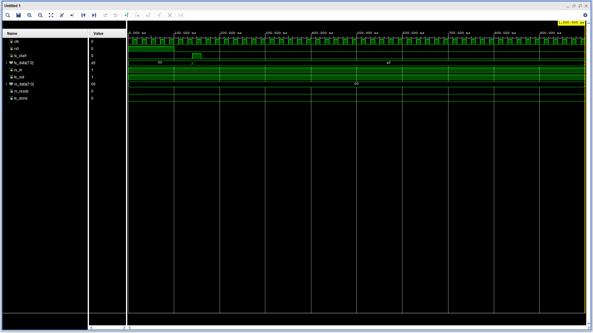
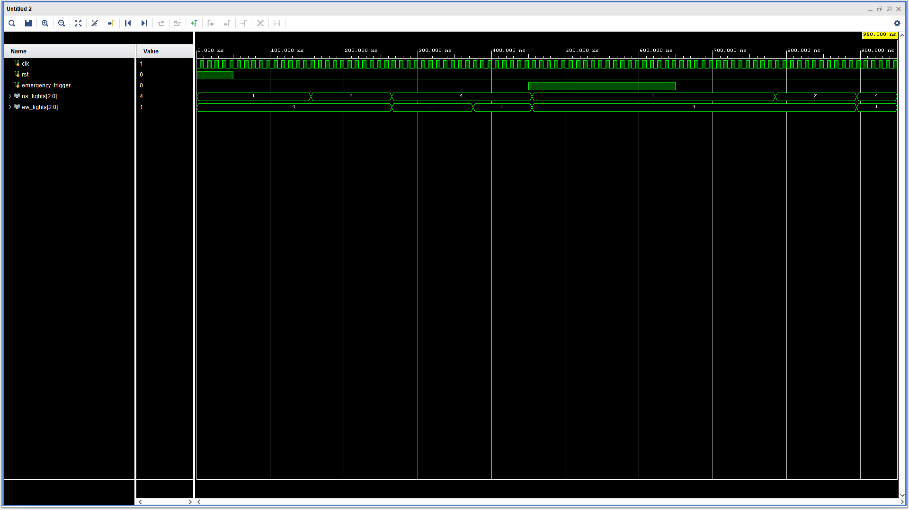

# Digital Electronics & VLSI Engineering Internship

This repository contains the core technical deliverables completed during my 1-Month Engineering Internship as a Project Intern at **Codec Technologies** under the AICTE National Internship Portal. 

The focus of this internship was designing, implementing, and verifying digital systems using **Verilog HDL** and **Xilinx Vivado**.

---

## 📡 Project 1: Universal Asynchronous Receiver-Transmitter (UART) Protocol

### 🔹 Overview
Designed a complete hardware modular UART system for serial asynchronous communication without a shared clock wire. The design utilizes a pre-agreed Baud Rate of 9600 bps to enable robust data transfer over a single transmission line.

### 🔹 Architecture & Modules
* **`baud_gen.v`**: A frequency divider that steps down a 50 MHz clock to generate timing pulses at 9600 Hz.
* **`uart_tx.v`**: A Finite State Machine (FSM) that serializes an 8-bit parallel byte, adding Start (0) and Stop (1) framing bits.
* **`uart_rx.v`**: A receiver module that oversamples incoming serial bits at the center of the bit period to reconstruct parallel data.
* **`uart_top.v`**: The structural top-level motherboard module wiring the generator, transmitter, and receiver together.

### 🔹 Verification Results
A loopback testbench (`tb_uart.v`) was used to feed the serialized output directly back into the receiver input. The functional simulation successfully verified end-to-end parallel-to-serial and serial-to-parallel data recovery.

#### Simulation Waveform:

---

## 🚦 Project 2: FPGA-Based Traffic Light Controller with Priority System

### 🔹 Overview
Developed a Finite State Machine (FSM) controlling a four-way intersection scheduler (North-South and East-West lanes). The system integrates a high-priority asynchronous override logic circuit to accommodate emergency vehicles safely.

### 🔹 Features
* **Hardwired Synchronous Counters**: Manages precise green-to-yellow-to-red cycle intervals.
* **Emergency Override (`emergency_trigger`)**: Instantly interrupts the normal scheduling loop, cycles active opposing lines safely to Red via a quick Yellow clear cycle, and grants an immediate Green light to the emergency lane.

### 🔹 Verification Results
Behavioral simulation (`tb_traffic_controller.v`) validated that the controller seamlessly sequences states under normal operations and immediately routes priority lanes to green upon receiving an active emergency signal sensor input.

#### Simulation Waveform:

---

## 🛠️ Toolchain Used
* **Hardware Description Language**: Verilog HDL
* **Simulation & IDE Tool Suite**: Xilinx Vivado Design Suite 2023.2

---
**Intern Details:**
* **Name:** Kishan Singh
* **Designation:** Digital Electronics & VLSI Intern
* **Company:** Codec Technologies India
* **AICTE ID:** CORPORATE6759d549ce59e1733940553
